# TestFlightご利用方法　

## TestFlightとは
App Storeにリリースしていないアプリを、TestFlight経由でインストールし、アプリの評価等を行うことのできるWebサービスです。

## TestFlightアカウントを登録する

1. TestFlightに登録するメールアドレスを担当までご連絡ください。後ほどこのメールアドレスに送られてくるメールのリンクをタップする必要がありますので、iOSデバイス上で読むことのできるメールアドレスが好ましいです。

2. その後担当がTestFlightに登録しているチームへの招待状をお送りしますので、[Accept]をタップします。

	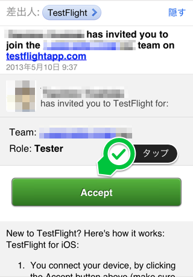
	
3. 必要な情報を入力し、[Sign Up]をタップします。

		- First Name  
		名前をローマ字で入力してください。
		- Last Name  
		姓をローマ字で入力してください。
		- Email Address  
		メールアドレスを入力してください。
		- Email Confirm  
		メールアドレスをもう一度入力してください。
		- Password  
		パスワード
		- Password Confirm  
		パスワードをもう一度入力してください。
		- Developer  
		OFFのままで結構です。

	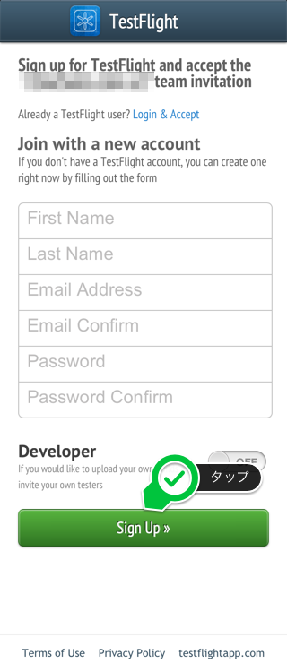	

4. 下記画面が表示されれば登録完了です。
	
	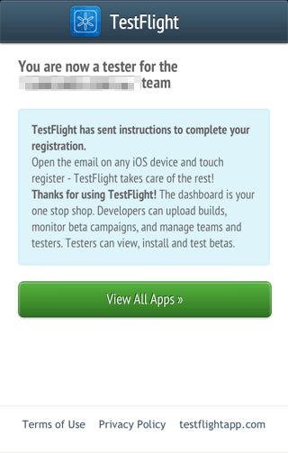

## TestFlightにデバイスを登録する
TestFlightにデバイスを登録します。登録を行なっていないデバイスではアプリのインストールができませんのでご注意ください。※この操作は必ずご利用になるデバイスにて行なってください。

1. アカウント登録後、下記ウェルカムメールが届きます。[Login]をタップします。

	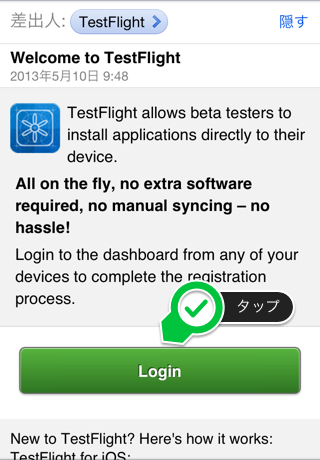

2. ログイン後、[Connect Device]をタップします。

	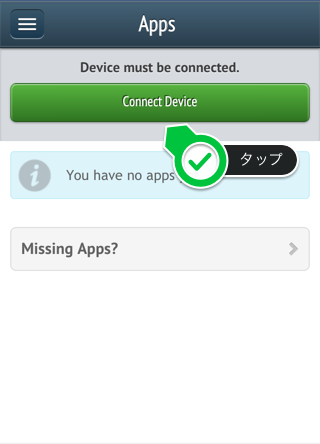
	
3. 更に[Recconect Device]をタップしてください。※当画面は表示されず、4へ行く場合があります。

	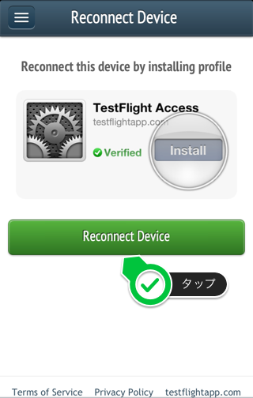
	
4. プロファイルのインストール画面が表示されますので、[インストール]をタップします。

	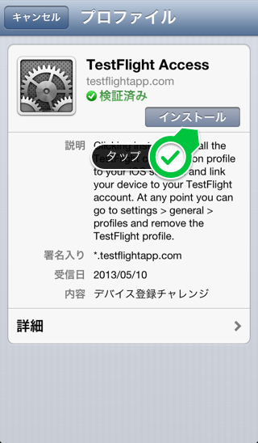
	
5. 更に[インストール]をタップしてください。

	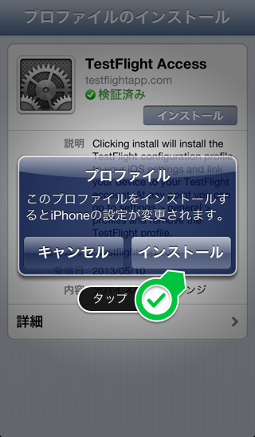
	
6. [完了]をタップしてください。

	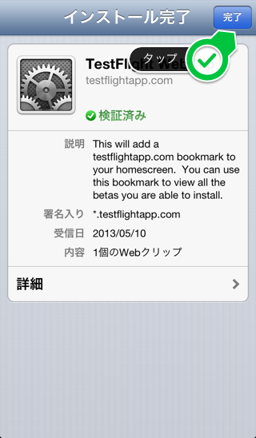
	
5. 下記画面が表示されればデバイス登録完了です。

	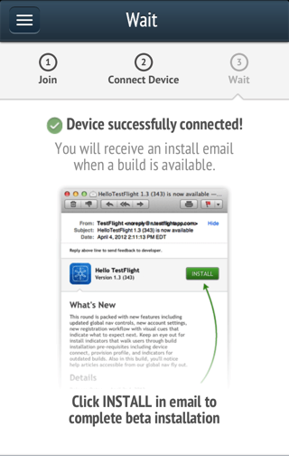
	
## アプリのインストール

1. デバイス登録完了後、弊社にてアプリの準備を行います。準備出来次第下記メールが送られてきますので、[インストール]をタップします。

	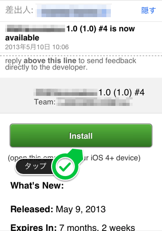

2. 更に[INSTALL]をタップします。

	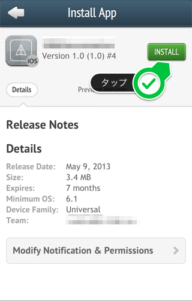
	
3. 更に[インストール]をタップします。

	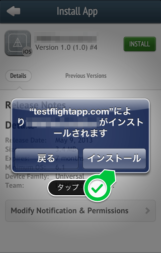
	
4. 通常通りホーム画面にアプリがインストールされますので、そのままご利用ください。尚、アプリにアップデートがあった場合は、1のメールが再度送られてきます。その場合は、同じようにアプリをインストールしてください。
